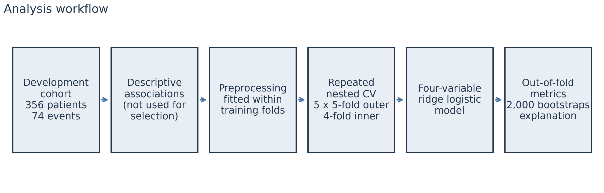
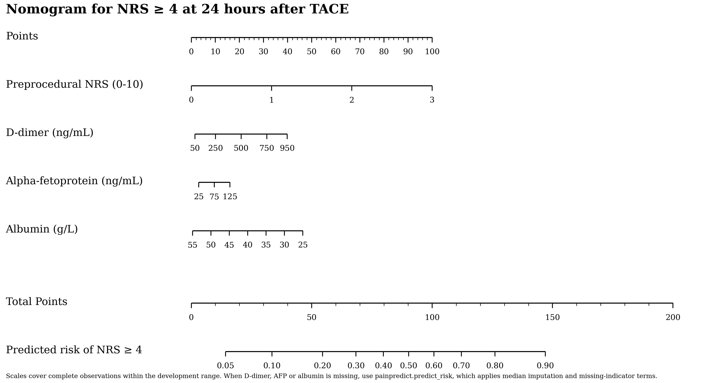
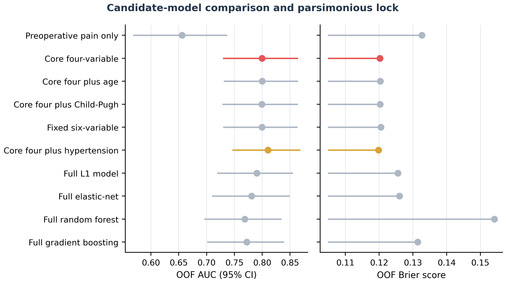
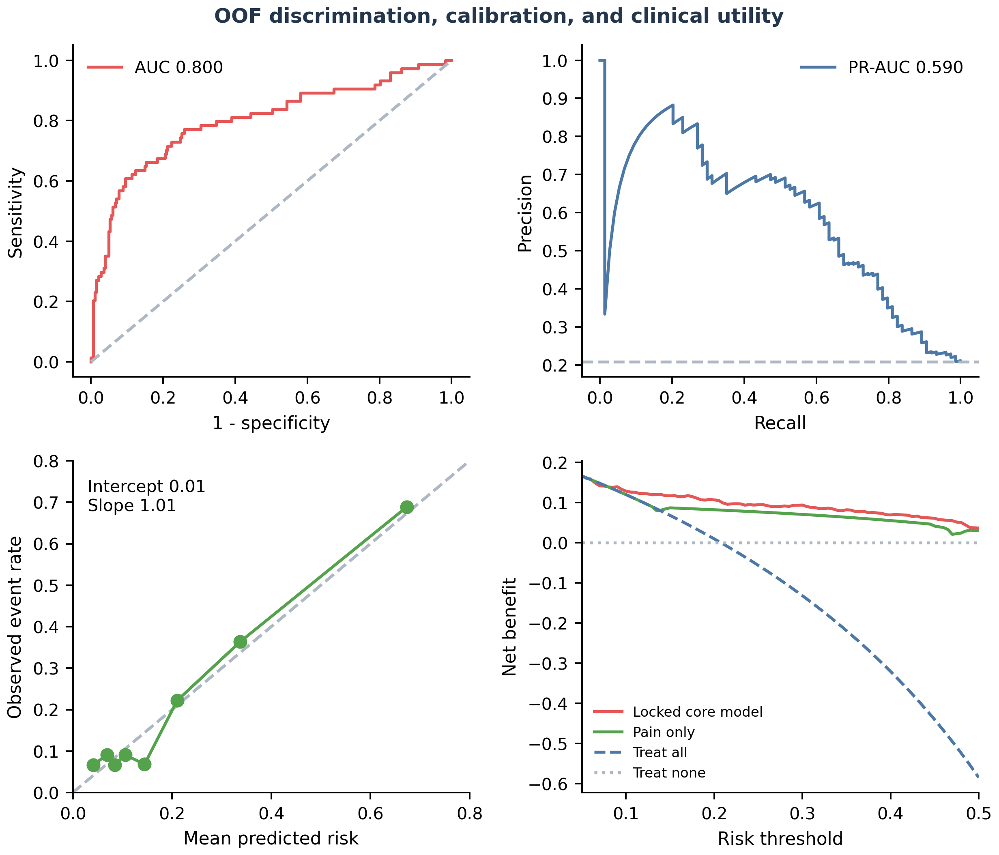

# PainPredict-TACE

[https://hahahahan233.github.io/painpredict-tace/](https://hahahahan233.github.io/painpredict-tace/)

Preprocedural risk model for clinically relevant pain after transarterial chemoembolization (TACE).

PainPredict-TACE estimates the probability that a patient will report a numeric rating scale (NRS) pain score of **4 or higher at 24 hours after TACE**. It uses four routinely available preprocedural measurements: preprocedural NRS, D-dimer, alpha-fetoprotein (AFP) and albumin. The model is a ridge (L2-penalized) logistic regression. It can be used through a Python API, a command-line tool, a closed-form equation or a printed nomogram.

> **Research use only.** The model was developed in a single centre and assessed by repeated internal validation. It has not been externally validated or evaluated prospectively, and it should not be used on its own to make clinical decisions.



## Contents

- [Installation](#installation)
- [Quick start](#quick-start)
- [Web calculator](#web-calculator)
- [Input variables](#input-variables)
- [Model performance](#model-performance)
- [Equation and nomogram](#equation-and-nomogram)
- [Figures](#figures)
- [Validating the model specification on your own data](#validating-the-model-specification-on-your-own-data)
- [Repository layout](#repository-layout)
- [Limitations](#limitations)
- [Data availability](#data-availability)
- [Citation and license](#citation-and-license)

## Installation

Python 3.9 or later is required. The packaged model was serialized with scikit-learn 1.5.1, which is pinned in the dependencies.

```bash
git clone https://github.com/hahahaHan233/painpredict-tace.git
cd painpredict-tace
pip install -e .
```

To run the tests:

```bash
pip install -e ".[test]"
pytest
```

## Quick start

### Command line

```bash
painpredict predict examples/example_patients.csv -o predictions.csv
```

The output keeps every input column and adds two columns:

| Column | Meaning |
| --- | --- |
| `predicted_risk` | Predicted probability of NRS ≥ 4 at 24 hours |
| `above_threshold` | `True` when `predicted_risk` ≥ 0.20, the operating point reported below; change it with `--threshold` |

Run `painpredict --help` to list all commands.

### Python

```python
import pandas as pd
from painpredict import predict_risk

patients = pd.DataFrame(
    {"Pre_PainScore": [0, 2], "D-dimer": [120, None], "AFP": [3.1, 12.4], "Albumin": [44.0, 33.8]}
)
predict_risk(patients)
#    predicted_risk  above_threshold
# 0        0.066648            False
# 1        0.358471             True
```

`painpredict.model_card()` returns the coefficients, preprocessing settings and development summary as a dictionary. `painpredict.load_model()` returns the underlying scikit-learn pipeline.

## Web calculator

An English and Chinese calculator is published at:

**<https://hahahahan233.github.io/painpredict-tace/>**

The page loads [`model_card.json`](src/painpredict/assets/model_card.json) and evaluates the published equation locally. Predictor values are not uploaded. Preprocedural NRS is required and must be an integer from 0 to 10. D-dimer, AFP and albumin may be left blank; the page then applies the same median imputation, missing indicator and capping rules as the Python model. Impossible entries block calculation. Unusual magnitudes and values outside the development range produce a warning, and the result states the value the model actually uses. The 0.20 display is the reported operating point, not a treatment recommendation.

To preview the page locally:

```bash
python scripts/build_web.py
python -m http.server 8000 --directory site
```

Then open <http://127.0.0.1:8000/>.

## Input variables

Column names are case-sensitive.

| Column | Variable | Unit | Missing values |
| --- | --- | --- | --- |
| `Pre_PainScore` | Preprocedural pain | NRS, 0–10 | Not allowed |
| `D-dimer` | D-dimer | ng/mL | Allowed |
| `AFP` | Alpha-fetoprotein | ng/mL | Allowed |
| `Albumin` | Albumin | g/L | Allowed |

Notes:

- Measurements should be taken before the procedure.
- A missing D-dimer, AFP or albumin value is replaced by the development-cohort median, and a missing-indicator term is added, exactly as during model development.
- Each laboratory value is capped at the bounds learned during development (D-dimer ≤ 962 ng/mL, AFP ≤ 152.6 ng/mL, albumin 22.95–55.35 g/L). Values beyond a bound contribute the same as the bound.
- In the development cohort preprocedural NRS ranged from 0 to 3. Higher values are accepted, but the predicted risk is then an extrapolation and a warning is issued.
- The D-dimer unit convention (FEU or DDU) was not specified in the source records. Check that your laboratory reports values on a comparable scale.

## Model performance

The model was developed in **356 patients, 74 (20.8%) of whom had NRS ≥ 4 at 24 hours**. Performance was estimated with out-of-fold (OOF) predictions from repeated nested cross-validation: 5 repeats of stratified 5-fold outer validation with 4-fold inner tuning of the penalty. Capping, imputation, scaling and tuning were fitted only within training folds. The 95% confidence intervals come from 2,000 patient-level bootstrap resamples.

| Metric | Estimate (95% CI) |
| --- | --- |
| AUC | 0.800 (0.731–0.863) |
| PR-AUC | 0.590 (0.476–0.715) |
| Brier score | 0.120 (0.098–0.145) |
| Calibration intercept | 0.01 (−0.41 to 0.45) |
| Calibration slope | 1.01 (0.76–1.33) |
| Sensitivity at risk ≥ 0.20 | 73.0% (62.5–82.9) |
| Specificity at risk ≥ 0.20 | 77.3% (72.5–82.3) |
| PPV at risk ≥ 0.20 | 45.8% (36.8–54.7) |
| NPV at risk ≥ 0.20 | 91.6% (87.7–95.0) |

Comparison with other models:

- **Preprocedural pain alone.** Against a model using preprocedural NRS only (AUC 0.656), the four-variable model improved the paired AUC by **+0.144 (0.055 to 0.239)** and reduced the Brier score by **0.0124 (0.0014 to 0.0241)**.
- **Six-variable model.** Adding age and Child-Pugh grade did not improve performance: the four-variable model's paired ΔAUC against the six-variable model was +0.0002 (95% CI −0.013 to 0.013). The four-variable model was chosen because it met prespecified criteria for non-inferior discrimination, probability error, calibration and net benefit with the fewest predictors.
- **Other approaches.** Penalized logistic, random-forest and gradient-boosting models using all 24 eligible candidate variables did not outperform the four-variable model.

The full tables are in [`results/`](results).

| Predictor | Odds ratio per SD (95% CI) |
| --- | --- |
| Preprocedural NRS | 2.00 (1.64–2.56) |
| D-dimer | 1.51 (1.22–1.89) |
| Alpha-fetoprotein | 1.34 (1.05–1.67) |
| Albumin | 0.73 (0.56–0.91) |

These are predictive associations within the model, not causal effects.

## Equation and nomogram

For a patient with all four values recorded, the predicted risk is

```
linear predictor = -0.25298
                   + 1.29066  x preprocedural NRS
                   + 0.0016481 x min(D-dimer, 962)
                   + 0.0050128 x min(AFP, 152.5725)
                   - 0.0590837 x clip(Albumin, 22.95, 55.35)

risk = 1 / (1 + exp(-linear predictor))
```

When a laboratory value is missing, substitute the median (D-dimer 226 ng/mL, AFP 5.23 ng/mL, albumin 40.0 g/L) and add its missing-indicator coefficient (D-dimer −1.34795, AFP −0.07461, albumin −2.08777). `painpredict.formula_risk()` implements this calculation, and the tests check that it matches the fitted pipeline. Full-precision terms are in [`results/raw_scale_equation.csv`](results/raw_scale_equation.csv) and in `model_card.json`.



To redraw the nomogram, run `painpredict nomogram -o figures`. Files are written to `figures/png`, `figures/pdf` and `figures/svg`.

## Figures

Figures are grouped by file type under [`figures/png`](figures/png), [`figures/pdf`](figures/pdf) and [`figures/svg`](figures/svg).

| Figure | Content |
| --- | --- |
| 0 | Analysis workflow |
| 1 | Descriptive predictor–outcome associations. These were not used to select variables. |
| 2 | Predictor eligibility and selection frequency across 25 outer-training L1 fits |
| 3 | OOF AUC and Brier score of all candidate models |
| 4 | OOF ROC, precision–recall, calibration and decision curves of the final model |
| 5 | Coefficients, permutation importance, SHAP and accumulated local effects |
| 6 | Points nomogram |

Figures 1–5 were produced from individual-level data and are provided as released. Figures 0 and 6 can be regenerated with `python scripts/make_figures.py`.

<p align="center">
  
  
</p>

## Validating the model specification on your own data

The `validate` command repeats the same development procedure (repeated nested cross-validation of the four-variable ridge model) on a CSV that you supply. The CSV must contain the four predictors and the outcome, given either as `event` (0/1) or as `nrs_24h` (0–10, where event means NRS ≥ 4).

```bash
painpredict validate my_cohort.csv -o runs/my_cohort --repeats 5 --bootstrap 2000
```

This writes `performance.csv`, `oof_predictions.csv` and `fold_audit.csv`. Add `--fit-final` to also refit the model on all rows and save it as `model.joblib`. You can then score new data with that refitted model using `painpredict predict --model`.

To validate the published model itself on an external cohort, score that cohort with `painpredict predict` and compare the predictions with the observed outcomes using `painpredict.validation.bootstrap_performance`.

### Synthetic demonstration data

[`examples/synthetic_cohort.csv`](examples/synthetic_cohort.csv) contains 356 **synthetic** rows. Their distributions resemble the published cohort summary, and the outcomes were generated from the published equation. The rows do not correspond to any patient, and metrics computed on them have no clinical meaning. To create a new synthetic cohort:

```bash
painpredict synth -o synthetic.csv -n 500 --seed 7
painpredict validate synthetic.csv -o runs/demo --repeats 1 --bootstrap 200
```

## Repository layout

```
src/painpredict/      Python package (prediction, validation, nomogram, CLI)
  assets/             Fitted pipeline (model.joblib) and model_card.json
results/              Cohort-level result tables from the development study
figures/              Paper figures, one folder per format
  png/ pdf/ svg/
examples/             Example input and synthetic demonstration cohort
web/                  Bilingual calculator source
scripts/              Figure regeneration and static-site build
tests/                Python and browser-model tests (synthetic data only)
```

## Limitations

- The model was developed in a single centre with 74 outcome events. Its performance in other populations, procedures or analgesic protocols is unknown.
- It was validated only internally, by repeated nested cross-validation. No temporal or external validation has been performed.
- It has not been evaluated in a prospective impact study. The 0.20 operating point is descriptive and is not a recommended treatment threshold.
- The coefficients describe predictive associations, not causal mechanisms.
- The highest preprocedural NRS in the development cohort was 3, and no patient reported NRS 8–10 at 24 hours.

## Data availability

Individual-level patient data are not publicly available because of ethical and privacy restrictions. The repository contains only cohort-level summaries, the fitted model and synthetic data. Reasonable requests for data access may be directed to the corresponding author of the accompanying article.

## Citation and license

If you use this model, please cite the accompanying article; the citation will be added here on publication. Citation metadata for the software is in [`CITATION.cff`](CITATION.cff).

The code is released under the [MIT License](LICENSE). The figures and result tables are released under [CC BY 4.0](https://creativecommons.org/licenses/by/4.0/).
